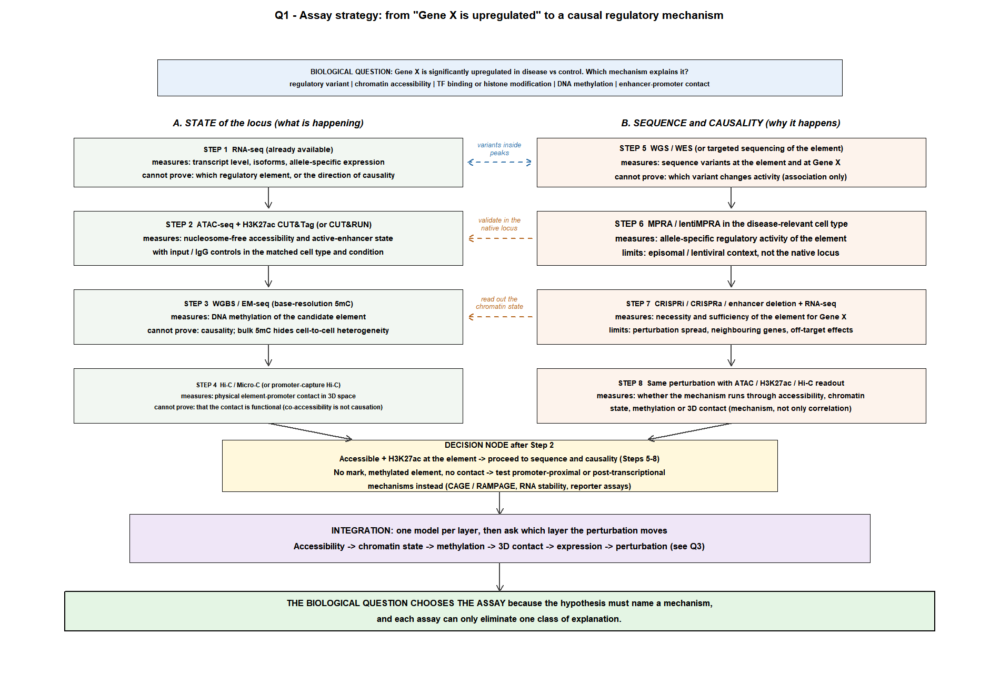
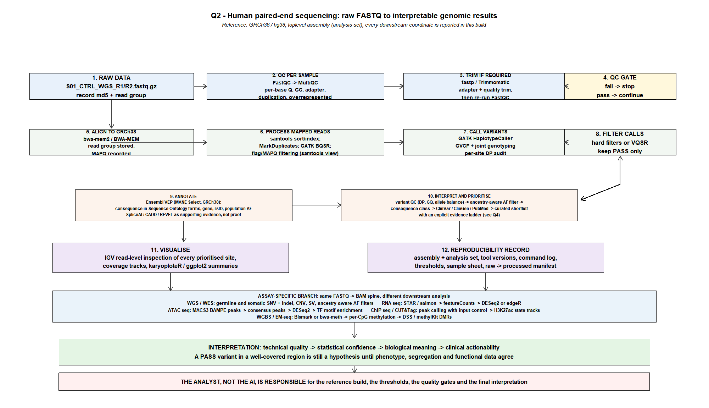
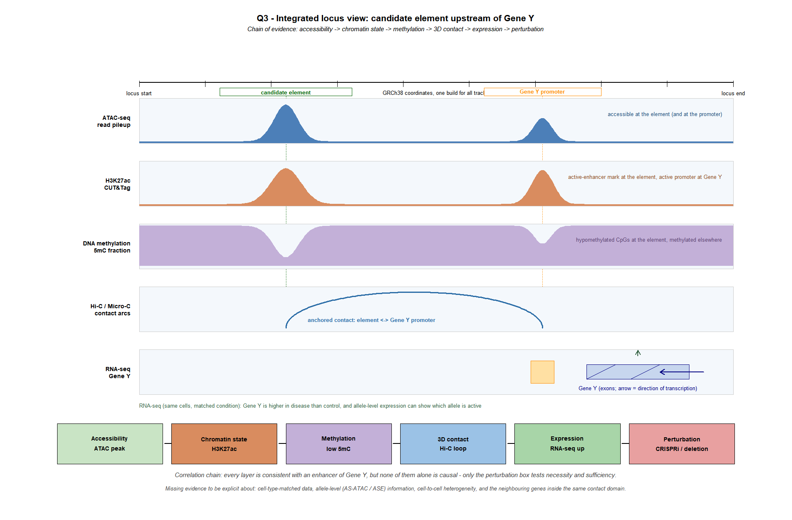

# Week 4 Homework — Genomics: Sequencing, Variant Interpretation, and AI-Assisted Analysis

**Student:** Zheng Shuotong
**Course:** Bioinformatics: From Multi-Omics Data to Discovery (SUAT, 2026 Fall) — Week 4
**Submission format:** Markdown report + four figures (`figures/`) + analysis code (`analysis/`)
**Data used:** the Week-4 student package (`data/`) plus public resources queried live (PubMed, Ensembl REST, gnomAD r4 GraphQL API, ClinVar through NCBI E-utilities)

## How AI was used in this submission

AI/agent use is required. In this report I worked with a terminal agent (Hermes Agent) that had access to a shell, a browser and the public APIs. For every question I first wrote my own plan and then used the agent to *critique and execute*, never to decide. Concretely, the agent was used to:

1. extract and summarise the Week-4 reading material (84 pages) so I could locate the relevant sections (assembly/coordinate conventions, FASTQ–alignment–VCF, chromatin measurement, 3D genome, AI-supported design);
2. write and run the base-R prioritisation script (`analysis/q4_filter_Zheng-Shuotong.R`) — the thresholds are mine, the syntax is the agent's;
3. compute QC statistics directly from the demo FASTQ instead of trusting the provided snapshot;
4. query PubMed (E-utilities), Ensembl REST (GRCh38 and GRCh37), the gnomAD r4 API and ClinVar to verify every claim that AI or the teaching files made;
5. draw the four figures (`analysis/make_figures.R`).

Every number that appears below was produced by a command that is listed in the Appendix, and every reference was resolved to a real PubMed ID before being cited. Where the agent (or the teaching material) was wrong, I say so explicitly — those corrections are part of the answer.

---

## Question 1 — Choose the Right Genomic Assay (25 pts)

### 1. My reasoning before AI

Gene X is upregulated in the disease group. The five proposed mechanisms are not competing explanations of the same measurement: they sit at different points of one causal chain (sequence variant → accessibility → TF/histone state → methylation → 3D contact → transcription). My plan was therefore not "pick the best assay" but "pick the assay that eliminates the largest number of mechanisms for the lowest cost, then let the result choose the next assay".

My first choice, before asking AI anything: **ATAC-seq (with a matched H3K27ac CUT&Tag/CUT&RUN as a second channel)**.

Reasons: (i) an accessible, nucleosome-depleted region is the most upstream measurable state and it localises the candidate element without knowing the variant; (ii) accessibility and the active-enhancer mark can be measured from the same tissue and condition that produced the RNA-seq result, so the comparison stays matched; (iii) both assays need far less material than ChIP-seq and give a genome-wide answer, which matters because I do not know where to look; (iv) the same data then define the intervals in which sequence variants, methylation and 3D contacts become interpretable.

What ATAC-seq alone cannot do, in my own words before AI: it cannot show which transcription factor binds, it cannot show that the element is *necessary* for Gene X, and it cannot distinguish a regulatory-element explanation from a promoter or post-transcriptional explanation.

### 2. AI-assisted workflow

I deliberately asked for a critique, not a design. Prompts used (abbreviated):

> "Here is my plan: ATAC-seq + H3K27ac CUT&Tag first, then WGS to find variants inside the accessible region, then MPRA, then CRISPRi. Do not redesign it. List (a) the mechanisms in my list that this plan cannot separate, (b) the steps where I confuse measurement with proof, (c) the order in which you would run the same assays and why."

The agent returned a critique with four items that I kept:

1. My plan tested "is a regulatory element involved" but would not separate **chromatin accessibility change** from **TF/histone change**, because both are read out by the same two assays; the agent pushed CUT&RUN/CUT&Tag for the specific TF or histone mark once the region is known.
2. Accessibility is not occupancy: footprinting from ATAC-seq is an *inference*, so TF binding needs an independent measurement.
3. A candidate variant inside the peak does not prove the mechanism — the functional step (MPRA, then endogenous perturbation) must stay in the plan.
4. Hi-C/Micro-C contact is correlative; the loop must be perturbed to test it (the ABC-model literature makes the same point).

It also proposed dropping ATAC-seq and going straight to WGBS because "methylation explains gene upregulation". I rejected that: methylation is one of the candidate mechanisms, not an entry point, and it would not localise the element or the variant.

### 3. Verification

Two independent classes of authoritative source were checked before accepting the design.

**(a) Primary method literature (PubMed E-utilities; PMIDs resolved individually).** ATAC-seq measures nucleosome-free accessibility and does not report TF identity by itself; Omni-ATAC reduces mitochondrial background and enables frozen tissue [1,2]. CUT&RUN and CUT&Tag give higher signal-to-noise than ChIP-seq at low input, but they are antibody/control dependent and require input or IgG controls [3–5]. MPRA-lentiMPRA reports allele-level regulatory activity in an episomal or lentiviral context and cannot reproduce the endogenous chromatin environment [6,7]. Hi-C/Micro-C report contact frequency, and contact alone does not establish which contacts regulate which gene — the ABC model was built precisely because proximity is not causation [8,9]. CRISPRi evidence is needed to move from correlation to causality [10,11].

**(b) Project-level documentation and review-level resources.** ENCODE candidate cis-regulatory elements are an annotation starting point, not a catalogue of proven enhancers; H3K27ac separates active from poised enhancers and predicts developmental state; Roadmap/ENCODE define the reference epigenome context used when a study has no matched tissue of its own [12–14].

Revisions I made after verification: (i) I kept ATAC-seq first but made the H3K27ac track explicitly *conditional* on the accessibility result (a peak with no H3K27ac in a matched tissue is not an active enhancer); (ii) I added CUT&RUN/CUT&Tag for the specific candidate TF/histone, not as a generic "ChIP-seq" box; (iii) I added an allele-resolved step (AS-ATAC / allele-specific expression) because a *cis*-regulatory mechanism predicts an allele imbalance, whereas a *trans* mechanism does not; (iv) I moved the WGS/WES step to run in parallel with the chromatin work rather than after it, since the variant search does not depend on the peak result.

### 4. Final conclusion



**Assay comparison (measures / strength / cannot prove / complement)**

| Assay | Measures | Strength for Gene X upregulation | Cannot prove | Complementary partner |
|---|---|---|---|---|
| WGS / WES | Germline sequence variants, including non-coding variants near the gene | Finds the candidate *cis* variant; no assumptions about activity | Which variant changes expression; regulatory effect is inferred | ATAC/H3K27ac (locate element), MPRA (allele activity) |
| ATAC-seq | Nucleosome-free accessibility | Localises candidate elements in the disease-relevant cells | TF identity; causality; occupancy (footprint = inference) | TF CUT&Tag/CUT&RUN, H3K27ac, MPRA |
| ChIP-seq / CUT&Tag / CUT&RUN | Protein–DNA binding, histone marks | Tests the TF/histone arm of the mechanism with a defined antibody | That binding at this site changes Gene X; needs good controls | ATAC-seq, motif analysis, CRISPRi |
| WGBS / EM-seq | Base-resolution 5mC (EM-seq also distinguishes 5mC/5hmC better) | Tests the methylation arm; finds differentially methylated CpGs | Causality; bulk data hides cell-to-cell heterogeneity and 5hmC in WGBS | ATAC-seq, AS-ATAC, reporter assays |
| CAGE / RAMPAGE | Transcription start sites, promoter usage, activity | Tests promoter-level explanations if the signal is not at an enhancer | Enhancer function; needs high RNA quality | ATAC/H3K27ac, RNA-seq |
| Hi-C / Micro-C | 3D contact frequency (also TAD/domain structure) | Shows whether element and promoter meet in the same condition | Functional regulation — proximity is not causation | CRISPRi deletion / loop-anchor perturbation |
| RNA-seq | Transcript abundance, isoforms, allele-specific expression | Confirms the phenotype and gives the *cis/trans* test | Mechanism; does not locate the element | Everything above |
| MPRA | Allele-specific regulatory activity of a sequence | Isolates the effect of the exact allele | Endogenous chromatin context, copy number, distance effects | CRISPRi at the native locus |
| CRISPR perturbation (CRISPRi/a, deletion) | Necessity/sufficiency of the element in the endogenous locus | The only step that can establish causality | Off-target and neighbourhood effects unless controlled | Reporter/allele-resolved readouts, Hi-C readout |

**~200-word explanation.**
Each assay measures one physical quantity and therefore removes one class of explanation, never all of them. RNA-seq measures accumulated transcripts; it can confirm that Gene X is up and can reveal allele imbalance, but it cannot say whether the cause is a promoter, an enhancer, methylation, or transcript stability. ATAC-seq measures nucleosome-free DNA and localises candidate elements, yet accessibility is not occupancy and footprinting is an inference. H3K27ac CUT&Tag/CUT&RUN measures a histone state associated with active enhancers; the mark can also be present without a functional effect on this gene. WGBS/EM-seq measures 5mC and reveals differentially methylated CpGs whose direction is inconsistent with a simple repressive model at an active enhancer. Hi-C/Micro-C measures contact frequency, which establishes opportunity, not regulation. MPRA isolates the activity of a single allele but outside the native locus, while CRISPRi/CRISPRa or a small deletion tests the element where it actually lives. The assays complement each other because each one closes a different gap: sequence data tells us where a variant is, chromatin data tells us what state the locus is in, methylation and 3D data tell us whether the state is plausible, and perturbation tells us whether it matters. Order matters because each result changes the next decision.

> **The biological question chooses the assay because** the hypothesis must name a *mechanism* (a sequence variant, a chromatin state, a modification, a contact, or a perturbation-defined function), and each assay can only eliminate the mechanisms it actually measures — only the perturbation step can turn a consistent story into a cause.

---

## Question 2 — From FASTQ to a Trustworthy Analysis Workflow (25 pts)

### 1. My reasoning before AI

I drew the workflow by hand from raw file to result:

`FASTQ → QC → (trim) → align → sort/index → duplicate marking → base-quality recalibration → variant calling → filtering → annotation → visualisation → interpretation → reproducibility record`

Purpose of each step, in my own words: QC tells me whether the file is usable at all and what the file actually *is* (adapter content, GC profile, duplication, read length); trimming exists only to fix a defect found at QC, and must be followed by re-QC; alignment converts reads into genome coordinates and is the step where the reference *build* enters the analysis, so the build must be recorded before alignment, not after; sorting/indexing makes the BAM queryable; duplicate marking prevents PCR copies from inflating depth; BQSR removes systematic base-call bias; genotyping turns aligned reads into a genotype with a depth and a quality; filtering separates "real call" from "possible artefact"; annotation gives biological meaning; visualisation is where I check suspicious sites by eye; the reproducibility record is what allows anyone (including me next week) to redo it.

From the manifest I also noted the design problems that a workflow must survive: eight samples in four case/control pairs across four assays; the ChIP-seq input control is "available separately" and must be requested; donor metadata for S04 is missing, so a population comparison over S03/S04 is confounded; S02 is stated to be from the same library prep batch as S01, so batch is a covariate, not a nuisance to ignore.

### 2. AI-assisted workflow

Plan-first prompt (abbreviated):

> "Do not write code yet. Here is my hand-drawn workflow and the reason for each step. (1) Identify logical gaps or steps that produce a result but no check. (2) For each gap, name the file format that should exist between the steps. (3) Then propose commands, and state the tool version and documentation page you are relying on for each parameter."

The agent's useful additions were: an explicit QC gate with a stop condition; the difference between "trim always" and "trim only what QC justifies"; a `MarkDuplicates` step between alignment and calling; the separation of BQSR from calling; a machine-readable sample sheet; and the split between the shared FASTQ→BAM→VCF spine and the assay-specific downstream branch (WGS/RNA/ATAC/ChIP/WGBS). I added the parts it omitted: per-site depth/allele-balance audit after calling, the IGV read-level check of every prioritised site, and the reproducibility manifest.

### 3. Verification

**Documentation checked for the workflow.** Reference build and analysis-set: GRCh38 is the current human reference (GRC/Ensembl; evaluated in [15]) and the Week-4 reading states explicitly that a reference allele is not automatically the common or benign allele; T2T-CHM13 was considered for previously unresolved regions but not chosen here because the clinical annotation ecosystem (ClinVar, most pipelines) is still GRCh38-centred [16]. Formats and tools were checked against their own documentation/releases: `fastp` and `Trimmomatic` for trimming [17,18]; `BWA-MEM`/`bwa-mem2` for short-read alignment; `samtools` for sort/index/flag filtering [19]; Picard/GATK `MarkDuplicates` and BQSR [20]; GATK `HaplotypeCaller` for genotyping; Ensembl VEP (MANE Select, Sequence Ontology consequence terms) for annotation [21,22]; MultiQC to aggregate QC [23]; IGV for read-level inspection [24].

**FastQC metrics — computed from the demo FASTQ, not copied from the snapshot.**
I did not have FastQC installed, so instead of trusting `fastqc_snapshot.tsv` I recomputed the underlying statistics directly from `data/demo_fastq/S01_CTRL_WGS_R1/R2.fastq.gz` (120 PE reads, 80 bp; all reads single-length; 0 % N). Five modules were interpreted:

| # | Metric | What I looked for | My computed values (R1) | Interpretation |
|---|---|---|---|---|
| 1 | Per-base sequence quality | mean and lower percentiles per cycle | mean Q 36.0 → 32.1 (cycle 50) → 27.1 (cycle 80); **p05 = 11 at cycles 55–80**; 15.0 % of bases < Q20 from cycle ~52 | The mean looks acceptable but the lower tail collapses. The snapshot claims "3′ median Phred ~12 after cycle 50 on ~15 % of R1" — confirmed exactly: the failure is confined to the adapter-bearing 15 % of reads, not a global instrument problem. Mean-only QC would have missed it |
| 2 | Adapter content | presence of the Illumina adapter k-mer | `AGATCGGAAGAGC` in **18/120 = 15.0 %** of R1 reads | Real adapter read-through → trim, then re-run QC. Snapshot FAIL agrees |
| 3 | Sequence duplication levels | fraction of identical molecules | one R1 template occurs **18×** (15 % of reads); R2 is 100 % unique | PCR/duplication trap: the *same* molecule was seen 18 times. In WGS this inflates DP and biases AF, so duplicates must be marked before calling; in RNA-seq/ATAC a UMI strategy is preferable |
| 4 | Per-sequence GC content | modality and shoulders | main mode 34–36 % GC; a second mode of **12 reads (10 %) at GC ≥ 70 % (up to 84 %)**; mean GC 42.8 % | The high-GC shoulder is a contaminant spike, not the adapter: adapter-bearing reads are *lower* in GC (33.8 %) than the rest (44.4 %). Snapshot WARN agrees |
| 5 | Overrepresented sequences / N content / length | repeats, N runs, length spread | adapter fragment is the top overrepresented k-mer; N = 0.0 %; all reads 80 bp | Confirms adapter origin (module 2) and excludes base-calling/length artefacts |

**AI-audit table (final workflow decisions).**

| AI recommendation | My verification | Final decision |
|---|---|---|
| "Align to hg19 because most tutorials and older annotation files use it" | GRCh38 is the current reference; annotation, ClinVar coordinates and gnomAD r4 are GRCh38-based; the Q4 table shows what mixed builds cost [15] | **Rejected.** Align to GRCh38 toplevel (no-alt analysis set) and record build + analysis set in the sample sheet |
| "Trim adapters by default for every library" | My recomputation shows 15 % adapter-containing reads, i.e. trimming is justified *here*; trimming without adapter evidence can remove real bases | **Modified.** Trim only after QC documents adapter/quality defects, then re-run FastQC |
| "Run VQSR for variant filtering" | VQSR is a cohort-level model; it needs many samples and known sites. A few samples do not support it | **Rejected** for this design; hard filters (QD, FS, MQ, DP, GQ) with a recorded rationale, and a cohort re-run later |
| "Duplicates do not matter for WGS, skip MarkDuplicates" | The duplicated template is 15 % of R1 and would inflate DP/AF at exactly the sites I care about | **Rejected.** Mark duplicates (and in targeted/UMI assays collapse by UMI) before calling |
| "Use the provided `fastqc_snapshot.tsv` as the QC result" | Snapshot claims were re-derived from raw reads: adapter 15 %, one template ×18, GC shoulder 10 %, p05 ≈ 11 after cycle 50 — the traps are real, but the means alone were misleading | **Accepted only after independent recomputation**, and the recomputed table is what I report |
| "Annotate consequences with one tool and use the label directly" | Consequence labels are tool- and transcript-set dependent; splice classes in particular need support (SpliceAI-style scores plus experimental validation) [21,25] | **Modified.** VEP on MANE Select, plus a splice-aware predictor and orthogonal read inspection for any splice call |

### 4. Final conclusion



The QC gate is the part of the pipeline that decides everything downstream: in this demo the library is *usable but not clean* — 15 % adapter-bearing reads with a low-quality tail, one duplicated template, and a 10 % high-GC contaminant spike. A workflow that trusts mean quality, or that treats the provided snapshot as ground truth, would carry all three defects into variant calling.

> **The analyst, not the AI, is responsible for** choosing the reference build and analysis set, defining each threshold, keeping the raw data and the audit trail, deciding what a QC metric means for *this* assay, and accepting or rejecting every recommendation — the AI can propose commands and read metrics, but it cannot know which defect matters for the question being asked.

---

## Question 3 — Integrate Multi-Omics Evidence into a Regulatory Hypothesis (25 pts)

### 1. My reasoning before AI

I read each layer independently first, deliberately without looking for a combined story:

- **ATAC-seq:** a peak over the candidate region means the DNA is nucleosome-depleted in this condition. It does not say which factor is bound, and it says nothing about necessity.
- **H3K27ac CUT&Tag/ChIP-seq:** the active-enhancer mark is present over the element (and at the promoter). This is a state, not a function; a marked element can be redundant with a neighbouring one.
- **Methylation:** CpGs inside the element are hypomethylated relative to the surrounding region. This is consistent with activity (methylation of enhancers is usually associated with reduced activity), but bulk 5mC mixes alleles and cells.
- **Hi-C/Micro-C:** a contact is detectable between the element and the Gene Y promoter. Contact frequency is population-averaged; a strong contact can be a structural bystander.
- **RNA-seq:** Gene Y is higher in disease than control in the same cells. This is the phenotype to be explained, and it is compatible with transcription-initiation change *or* with RNA-stability change.

My preliminary integrated model: the element is a plausible enhancer of Gene Y, because accessibility and the active mark co-occur with a promoter contact and hypomethylation, exactly where Gene Y changes. My own immediate objection: every item in that model is a correlation, and three of them would look the same if the element regulated a *different* gene in the same contact domain.

### 2. AI-assisted workflow

Prompt used (abbreviated):

> "Separate my evidence into (1) direct observations that the data actually show, (2) biological interpretations that require assumptions, (3) missing evidence. Do not summarise the pathway. Then give the two strongest alternative explanations consistent with the same observations."

The classification step was useful, because it forced me to move three items I had written as observations into interpretations: "the element is an enhancer" (interpretation), "methylation loss causes activation" (interpretation, direction not established), and "the loop brings the element to the promoter" (interpretation — Micro-C gives contact, not direction).

### 3. Verification

Where I checked the agent's framing: the claim that H3K27ac marks *active* enhancers (rather than merely developmentally poised ones) is from the primary literature [13,14]; the claim that enhancer–promoter contact is insufficient to establish regulation, and that CRISPRi is the gold standard for causality, is from the CRISPRi/ABC literature [9,10,11]; the claim that bulk WGBS cannot separate 5mC from 5hmC is stated in the Week-4 reading (question 7 of the self-check) and matches the EM-seq method paper [26]; the statement that accessibility peaks require matched cell types is from the ATAC-seq/Omni-ATAC papers and ENCODE resources [1,2,12]. I rejected the agent's suggestion to "call the element an enhancer because ENCODE labels it one" — ENCODE cCREs are annotations [12].

### 4. Final conclusion



**Observations vs interpretations vs missing evidence**

| Layer | Direct observation | Interpretation (needs assumptions) | Missing evidence |
|---|---|---|---|
| ATAC-seq | Nucleosome-free peak over the element; the marker in the disease condition | An active regulatory element exists here; the peak is not a boundary/insulator artefact | Allele-resolved accessibility (AS-ATAC); TF identity; whether this peak changes between case and control rather than just existing |
| H3K27ac | Mark over the element and the Gene Y promoter | The element is an *active* enhancer rather than a poised one | Quantitative case/control comparison, replicate reproducibility, matched input control quality |
| Methylation | Element CpGs less methylated than flanking CpGs (bulk) | Element activity is not suppressed by methylation | Single-cell / long-read context, 5hmC status, allele-specific methylation |
| Hi-C / Micro-C | Contact frequency between element and promoter is above background | The contact is regulatory and not a bystander within the domain | Directional/loop-anchor data, domain-wide contact map, dependence on cohesin/CTCF |
| RNA-seq | Gene Y expression higher in disease than control | The increase reflects increased *initiation* at Gene Y | Nascent transcription (4sU/EU, intron-spanning reads), RNA-stability measurement, allele-specific expression |

**Alternative explanation.** The element is not Gene Y's enhancer but the promoter of a neighbouring non-coding transcript (or an alternate promoter of Gene Z inside the same contact domain). Every observation still holds: the peak, the mark, the loop and the hypomethylation belong to *that* element, which happens to sit inside a contact that also reaches Gene Y. Gene Y's increase could then be driven by a second element, by copy-number/3D reorganization, or by transcript stabilization. A CTCF/insulator-architecture check and gene-level expression of all genes in the domain would test this immediately; a domain-wide perturbation screen (tiling CRISPRi across the domain) would separate the two hypotheses properly [10,11,27].

**Functional experiment.** CRISPRi (dCas9-KRAB) with several independent guide RNAs flanking the element plus a small (2–4 kb) homozygous deletion in the matched cell type, with non-targeting guides, a guide-resistant rescue, and a promoter-distal control element as controls:
- *If the element is a causal enhancer:* Gene Y nascent transcription drops, and allele-resolved readouts in a heterozygous line show loss of transcription from the *cis* allele; accessibility at the promoter and the 3D contact also weaken.
- *If the alternative is true:* Gene Y is unchanged (or changes together with the neighbouring transcript), while the neighbouring transcript's promoter loses activity — a pattern distinguishable by measuring both transcripts and, ideally, by an MPRA on the exact element as an orthogonal, allele-level test [6,7].
Readout: nascent RNA (4sU/EU or intron-spanning qPCR) *plus* steady-state RNA, so an RNA-stability confound cannot masquerade as an initiation change.

**~200-word interpretation.**
The four epigenomic layers agree with one another, and that agreement is exactly why the picture is dangerous: agreement among correlated measurements is not evidence of causality. Accessibility shows that the region can be engaged; H3K27ac shows it carries an activity-associated mark; hypomethylation shows the DNA is not locked into a repressive modification; the Hi-C contact shows that the element and the Gene Y promoter are physically connected in a detectable fraction of cells. Each of these is a necessary-looking condition for an enhancer, and none of them is a sufficient condition for regulation. What the layers cannot show is direction: whether the element drives Gene Y, whether Gene Y's activation recruits the loop, or whether both follow a third cause. They also cannot resolve cell-to-cell heterogeneity (bulk data), allele specificity, or whether the observed increase in Gene Y RNA comes from transcription initiation or slower decay. The one experiment that converts this model into a testable claim is an endogenous perturbation — CRISPRi, a small deletion, or loop-anchor perturbation — interpreted with a nascent-transcription readout and controls for the neighbouring genes that share the same contact domain.

> **The candidate element regulates Gene Y by** acting as a *cis*-regulatory enhancer whose accessibility, H3K27ac state and promoter contact in the disease condition increase Gene Y transcription initiation, **and this can be tested by** CRISPRi or deletion of the element in the matched cell type with nascent-transcription (4sU / intron-spanning) and allele-resolved readouts, complemented by an MPRA on the exact element.

---

## Question 4 — AI-Assisted Variant Prioritization (25 pts)

### 1. My reasoning before AI

The table is a teaching table, so the filtering logic matters more than the winner. My logic, written before any tool ran:

1. **Technical quality first** — `FILTER`, then `DP` (a het call at DP 5–8 can be a single-molecule artefact), then `GQ` (a genotype without a posterior is not a genotype). Technical filters come before any biological filter, because biology applied to artefacts produces confident nonsense.
2. **Population frequency** — a rare variant is more likely to be a causal candidate for a monogenic-style effect, but the ceiling must be justified per ancestry, and a common variant can still be a risk allele with incomplete penetrance (F5 Leiden is the classic example).
3. **Functional consequence** — loss-of-function and canonical splice classes carry more weight than missense, which carries more than synonymous/intergenic; my consequence list is a *hypothesis* about impact, not proof.
4. **Biological/clinical evidence** — ClinVar/ClinGen significance, gene-level constraint, and whether the gene fits the phenotype; "Pathogenic" in a column is a claim to be verified, not evidence in itself.

I also wrote down a rule for myself: *rank by the evidence I can verify, and keep the ranking auditable at every step.*

### 2. AI-assisted workflow

Plan-first prompt (abbreviated):

> "Here is my filtering logic and the thresholds I intend to use. Do not choose the winner. Write one base-R script that (a) applies my filters step by step, (b) prints how many variants survive each step and why each excluded variant was excluded, (c) sorts survivors by consequence tier, then clinical significance, then allele frequency. Use base R only, because I cannot install packages right now."

The agent produced `analysis/q4_filter_Zheng-Shuotong.R` from my thresholds (DP ≥ 20 so that a heterozygote has roughly ≥ 10 reads per allele; GQ ≥ 30 so the called genotype has posterior ≥ 0.999; AF ≤ 0.001 as a conservative rarity ceiling; `FILTER == PASS`; a gene symbol must be present; LoF/splice classes ranked above missense). Running it with R 4.4.3 produced a real funnel and shortlist (full console output in `analysis/q4_filter_output.txt`):

| Step | Variants kept |
|---|---|
| 00 all records | 12 |
| 01 FILTER == PASS | 10 |
| 02 DP ≥ 20 | 9 |
| 03 GQ ≥ 30 | 9 |
| 04 AF ≤ 0.001 | 6 |
| 05 gene symbol present | 5 |
| 06 impact consequence | 4 |

Survivors after step 06, ordered by tier → ClinVar rank → AF:

| CHROM | POS (as given) | GENE | CONSEQUENCE | DP | GQ | AF | CLINVAR_SIG | Tier |
|---|---|---|---|---|---|---|---|---|
| chr17 | 7673803 | TP53 | splice_acceptor_variant | 80 | 99 | 0.00001 | Pathogenic | tier1 (LoF/splice) |
| chr12 | 25398284 | KRAS | missense_variant | 58 | 91 | 0.00015 | Conflicting | tier2 (missense) |
| chr13 | 32316461 | BRCA2 | missense_variant | 60 | 90 | 0.00010 | Uncertain_significance | tier2 |
| chr19 | 11200200 | LDLR | missense_variant | 40 | 88 | 0.00020 | Likely_benign | tier2 |

Excluded, with the reason the script prints for each: F5 (AF 0.42 > 0.001), ATM (AF 0.18 > 0.001), chr4 intronic (AF 0.35 > 0.001), CFTR (synonymous), chr8 intergenic (no gene symbol), MSH2 stop_gained (FILTER = LowQual), HLA-A (FILTER = FAIL), MECP2 frameshift (DP 5 < 20 — note that this is the single most attractive-looking false lead in the table: a frameshift in a disease gene at DP 5 / GQ 20 is a molecule, not a genotype).

### 3. Verification

Four independent checks were run before accepting the ranking. All of them were executed against live databases and the raw table.

**Check 1 — genome-build consistency (Ensembl REST overlap, GRCh38 vs GRCh37, one call per variant).** The table silently mixes builds:

| Variant (as given) | Gene label | Ensembl overlap GRCh38 | Ensembl overlap GRCh37 | Verdict |
|---|---|---|---|---|
| chr17:7673803 | TP53 | inside TP53 (7,661,779–7,687,546) | DNAH2 | GRCh38 coordinates |
| chr13:32316461 | BRCA2 | inside BRCA2 (32,315,086–32,400,268) | RXFP2 | GRCh38 |
| chr6:29942857 | HLA-A | inside HLA-A (29,941,260–29,949,606) | no gene returned | GRCh38 |
| chr11:108323000 | ATM | inside ATM (108,222,788–108,369,102) | C11orf65 only | GRCh38 |
| chr1:169519049 | F5 | inside F5 (169,511,951–169,586,699) | inside F5 (169,483,404–169,555,826) | ambiguous (both) |
| chr2:47641560 | MSH2 | inside MSH2 | inside MSH2 | ambiguous (both) |
| chr7:117199644 | CFTR | ST7 (i.e. wrong gene) | inside CFTR (117,105,838–117,356,025) | **GRCh37** |
| chr19:11200200 | LDLR | DOCK6 | inside LDLR (11,200,038–11,244,492) | **GRCh37** |
| chr12:25398284 | KRAS | no gene returned | inside KRAS (25,357,723–25,403,870) | **GRCh37** (the canonical hg19 KRAS codon-12 position; GRCh38 equivalent 25,245,351) |
| chr8:128750000 | "." (intergenic) | CCDC26 region | inside MYC (128,747,680–128,753,674) | **GRCh37**, and not intergenic there at all |
| chrX:153870000 | MECP2 | inside L1CAM | a pseudogene region | fits **neither** build's MECP2 |
| chr4:88000000 | "." (intronic) | intergenic/other | inside AFF1 (intron) | **GRCh37** |

Consequence for my ranking: I re-checked the top candidate in GRCh38 space, where its position is genuinely inside TP53 — but the build mix means every coordinate must be lifted before the variants are compared with tracks from another study.

**Check 2 — ClinVar identifier validity.** `VCV000012345`, given as the TP53 record, resolves in ClinVar to variation 12345 = `NM_001065.4(TNFRSF1A):c.295T>A (p.Cys99Ser)`, not TP53. The IDs in the teaching table are placeholders; a pipeline that reports an ID without resolving it can attach the wrong gene to a patient.

**Check 3 — population frequency (gnomAD r4 API).** The row for F5 states AF = 0.42. The real variant at this locus (rs6025, Factor V Leiden; GRCh38 `1-169549811-C-T`) has gnomAD r4 allele frequency **0.0173 (genomes; AC 2,635 / AN 152,318)** and **0.0219 (exomes; AC 31,939 / AN 1,460,848)** — about 25-fold lower than the table claims, and strongly ancestry-dependent (gnomAD exomes: NFE 0.0246, FIN 0.0212, SAS 0.0140, AMR 0.0071, AFR 0.0029, EAS 7.6 × 10⁻⁵). ClinVar's own records for rs6025 are not a clean "Benign" either: the aggregate strings returned by Ensembl include *uncertain significance, benign, pathogenic, drug response, risk factor, pathogenic low penetrance*. So the teaching row is right about the teaching point (a common-ish allele whose clinical action is weak and context-dependent) and wrong about the numbers.
For the top candidate I also queried GRCh38 `17-7673803-G-A`: gnomAD r4 lists it with genome AF 0 (AC 0 / AN 152,044) and exome AF 4.1 × 10⁻⁶ (AC 6 / AN 1,461,760) — consistent with an ultra-rare site, and the reference point TP53 p.Arg175His (rs28934578, `17-7675088-C-T`) behaves the same way (7 × 10⁻⁶ genomes / 4 × 10⁻⁶ exomes).

**Check 4 — clinical/gene-level evidence and method depth.** KRAS codon-12 alleles: ClinVar records for the real rs121913530 alleles are **germline Pathogenic / Likely pathogenic** (`NM_004985.5(KRAS):c.34G>C p.Gly12Arg` pathogenic/likely pathogenic; `c.34G>T p.Gly12Cys` likely pathogenic), whereas the table labels it "conflicting". TP53 is a loss-of-function-intolerant tumour suppressor (gnomAD constraint [28,29]). Splice-consequence labels are tool-dependent and need independent support [25]; ACMG/AMP criteria and the ClinGen framework are the reference for how such evidence is weighed [30,31].

### 4. Final conclusion

**Prioritisation for further investigation: two variants.**

1. **chr17:7673803 G>A, TP53, `splice_acceptor_variant`** — the only variant that survives *every* technical filter and sits in the highest-impact consequence tier (PASS, DP 80, GQ 99, AF 1 × 10⁻⁵, LoF-intolerant gene). It is a canonical splice-acceptor-adjacent change, i.e. a mechanism that can be checked experimentally without knowing anything else about the patient.
2. **chr12:25398284 C>A, KRAS, `missense_variant` (codon-12 hotspot)** — second because the *mechanism* is weaker (missense) and the *context* is unresolved (a codon-12 hotspot is usually a somatic, treatment-relevant event, and the table's own ClinVar label disagrees with the real ClinVar records), but the consequence class, depth and rarity all pass.

**False-lead critique (asked of AI, then judged myself):**

| Concern raised | Scientifically important? | Why |
|---|---|---|
| The TP53 call comes from a single caller with no orthogonal confirmation; the synthetic table has no read-level data | **Yes** | A splice-acceptor call can be produced by mismapping or by a nearby indel; a second caller and raw-read inspection in IGV are cheap and decisive |
| The table mixes GRCh38 and GRCh37 coordinates | **Yes** | Any comparison with external tracks, ClinVar or gnomAD coordinates becomes wrong by thousands of bases; my own top-candidate check was only valid after fixing the build |
| Germline vs tumour: TP53 and KRAS are both cancer genes | **Yes** | It changes which ACMG/AMP rules apply, whether the finding is reported clinically, and whether segregation is even relevant |
| The ClinVar IDs are placeholders and the AF values are unrealistic (F5 0.42) | Yes for the *process*, no for the *ranking* | This invalidates any appeal to the table's clinical column, so verification had to come from real databases; it does not by itself change which rows survive technical filtering |
| "Splice_acceptor_variant" might be a mis-annotated consequence (e.g. a synonymous or intronic change near the junction) | Yes | The consequence label is one tool's call; SpliceAI-style support and RT-PCR are the test [25] |
| The MECP2 frameshift "Pathogenic" looks more severe than the TP53 splice variant | No (in the other direction) | It fails the depth filter (DP 5); severity of the label does not compensate for a genotype that may not exist |
| The intergenic/intronic rows disappeared from the shortlist | No | They were excluded by design (no gene symbol / non-coding); their absence is not a finding |

Residual risks I accept: the top variant has not been confirmed by a second caller or by read inspection; TP53 splicing has not been measured; and the germline/somatic context is unknown. All three are addressable with routine experiments.

**~200-word final interpretation (known evidence → computational inference → scientific hypothesis → required experiment).**
*Known evidence:* the table contains one rare, technically clean splice-acceptor candidate in TP53 (DP 80, GQ 99, AF ≈ 1 × 10⁻⁵) and one rare codon-12 KRAS missense; every other row fails a documented technical or biological filter, and the table's own clinical/AF columns are placeholders that I replaced with real database values. *Computational inference:* the TP53 change sits in a loss-of-function-intolerant gene, in a canonical splice-acceptor context, at a coordinate that is inside TP53 in GRCh38, while the KRAS change is a hotspot whose interpretation depends on somatic context. *Scientific hypothesis:* the TP53 allele impairs canonical splice-acceptor use at the affected exon, reducing functional p53 dosage, whereas the KRAS allele is more likely a somatic driver event in a tumour than a germline susceptibility allele. *Required experiment:* confirm the call with an orthogonal caller plus IGV read inspection; then test splicing with an RT-PCR across the affected junction or a minigene assay, and, for KRAS, sequence matched tumour/normal tissue to establish the somatic status. Both experiments distinguish "interesting variant" from "molecular cause" and neither requires new AI inference to interpret.

> **Variant chr17:7673803 G>A (TP53 splice acceptor) may influence TP53 transcript integrity and p53-dependent cellular phenotypes by affecting canonical splice-acceptor use; this can be tested by** orthogonal re-calling with read-level inspection plus RT-PCR or minigene splicing assays (and, for the KRAS codon-12 candidate, matched tumour/normal sequencing to establish somatic status).

---

## References

Verified through PubMed E-utilities (`esummary`) unless marked as a database query. PMIDs as resolved on the date of this work.

1. Buenrostro JD, et al. Transposition of native chromatin for fast and sensitive epigenomic profiling of open chromatin, DNA-binding proteins and nucleosome position. *Nat Methods* 2013. PMID 24097267
2. Corces MR, et al. An improved ATAC-seq protocol reduces background and enables interrogation of frozen tissues. *Nat Methods* 2017. PMID 28846090
3. Skene PJ, Henikoff S. An efficient targeted nuclease strategy for high-resolution mapping of DNA binding sites. *eLife* 2017. PMID 28079019
4. Kaya-Okur HS, et al. CUT&Tag for efficient epigenomic profiling of small samples and single cells. *Nat Commun* 2019. PMID 31036827
5. Kaya-Okur HS, et al. Efficient low-cost chromatin profiling with CUT&Tag. *Nat Protoc* 2020. PMID 32913232
6. Tewhey R, et al. Direct identification of hundreds of expression-modulating variants using a multiplexed reporter assay. *Cell* 2016. PMID 27259153
7. Kircher M, et al. Saturation mutagenesis of twenty disease-associated regulatory elements at single base-pair resolution. *Nat Commun* 2019. PMID 31395865
8. Lieberman-Aiden E, et al. Comprehensive mapping of long-range interactions reveals folding principles of the human genome. *Science* 2009. PMID 19815776
9. Fulco CP, et al. Activity-by-contact model of enhancer–promoter regulation from thousands of CRISPR perturbations. *Nat Genet* 2019. PMID 31784727
10. Fulco CP, et al. Systematic mapping of functional enhancer–promoter connections with CRISPR interference. *Science* 2016. PMID 27708057
11. Gasperini M, et al. A genome-wide framework for mapping gene regulation via cellular genetic screens. *Cell* 2019. PMID 30849375
12. ENCODE Project Consortium. Expanded encyclopaedias of DNA elements in the human and mouse genomes. *Nature* 2020. PMID 32728249
13. Creyghton MP, et al. Histone H3K27ac separates active from poised enhancers and predicts developmental state. *PNAS* 2010. PMID 21106759
14. Roadmap Epigenomics Consortium. Integrative analysis of 111 reference human epigenomes. *Nature* 2015. PMID 25693563
15. Schneider VA, et al. Evaluation of GRCh38 and de novo haploid genome assemblies demonstrates the enduring quality of the reference assembly. *Genome Res* 2017. PMID 28396521
16. Nurk S, et al. The complete sequence of a human genome. *Science* 2022. PMID 35357919
17. Chen S, et al. fastp: an ultra-fast all-in-one FASTQ preprocessor. *Bioinformatics* 2018. PMID 30423086
18. Bolger AM, et al. Trimmomatic: a flexible trimmer for Illumina sequence data. *Bioinformatics* 2014. PMID 24695404
19. Danecek P, et al. Twelve years of SAMtools and BCFtools. *GigaScience* 2021. PMID 33590861
20. McKenna A, et al. The Genome Analysis Toolkit: a MapReduce framework for analyzing next-generation DNA sequencing data. *Genome Res* 2010. PMID 20644199
21. McLaren W, et al. The Ensembl Variant Effect Predictor. *Genome Biol* 2016. PMID 27268795
22. Eilbeck K, et al. The Sequence Ontology: a tool for the unification of genome annotations. *Genome Biol* 2005. PMID 15892872
23. Ewels P, et al. MultiQC: summarize analysis results for multiple tools and samples in a single report. *Bioinformatics* 2016. PMID 27312411
24. Robinson JT, et al. Integrative genomics viewer. *Nat Biotechnol* 2011. PMID 21221095
25. Jaganathan K, et al. Predicting splicing from primary sequence with deep learning. *Cell* 2019. PMID 30661751
26. Vaisvila R, et al. Enzymatic methyl sequencing detects DNA methylation at single-base resolution from picograms of DNA. *Genome Res* 2021. PMID 34140313
27. Dixit A, et al. Perturb-Seq: dissecting molecular circuits with scalable single-cell RNA profiling of pooled genetic screens. *Cell* 2016. PMID 27984732
28. Karczewski KJ, et al. The mutational constraint spectrum quantified from variation in 141,456 humans. *Nature* 2020. PMID 32461654
29. Chen S, et al. A genomic mutational constraint map using variation in 76,156 human genomes. *Nature* 2024. PMID 38057664
30. Richards S, et al. Standards and guidelines for the interpretation of sequence variants (ACMG/AMP). *Genet Med* 2015. PMID 25741868
31. Rehm HL, et al. ClinGen — the Clinical Genome Resource. *N Engl J Med* 2015. PMID 26014595
32. Landrum MJ, et al. ClinVar: improving access to variant interpretations and supporting evidence. *Nucleic Acids Res* 2018. PMID 29165669

**Databases and documentation queried live (not references):** Ensembl REST `rest.ensembl.org` and `grch37.rest.ensembl.org` (gene overlap and variation endpoints); gnomAD r4 GraphQL API (`gnomad.broadinstitute.org/api`); NCBI E-utilities (PubMed `esummary`, ClinVar `esearch`/`esummary`); the Week-4 reading material and homework package in the course repository.

---

## Appendix — reproducibility record

All commands were run on the student machine (Windows, git-bash, R 4.4.3 at `D:\R\R-4.4.3`, Python 3.11). Files delivered with this report:

```
week4/
  Homework for week 4 - Genomics and variant interpretation (EN).md   <- this report
  figures/Q1_workflow.png, Q2_workflow.png, Q3_locus_chain.png, Q4_prioritization.png
  analysis/make_figures.R                    # draws all four figures (base R)
  analysis/q4_filter_Zheng-Shuotong.R        # Q4 filters, thresholds documented in-file
  analysis/q4_filter_output.txt              # real console output (funnel, shortlist, exclusions)
  analysis/q4_shortlist.tsv, q4_filter_funnel.txt
  analysis/q2_fastq_qc_notes.md              # starter cheat-sheet used for metric interpretation
  data/                                      # the Week-4 student package (unchanged), copied for reproducibility
```

Key steps and what each produced:

| Step | Command / API | Result used in the report |
|---|---|---|
| Read the course material | `pdftotext -enc UTF-8 "<lecture/reading>.pdf" out.txt` | section-level understanding of build/coordinate conventions, chromatin measurement, 3D genome |
| Fetch the student package | `git clone --depth 1 --filter=blob:none --sparse <course repo>` + `git sparse-checkout set "Week 4"` | `data/`, `templates/`, `starter/` files |
| QC from raw reads | Python 3 (gzip) over `data/demo_fastq/S01_CTRL_WGS_R1/R2.fastq.gz` | adapter 15.0 %, one template ×18, GC shoulder 10 % ≥ 70 % GC, p05 quality ≈ 11 from cycle 52 |
| Q4 filtering | `Rscript q4_filter_Zheng-Shuotong.R` (base R 4.4.3) | funnel 12→4, shortlist, per-variant exclusion reasons |
| Build check | `rest.ensembl.org/overlap/region/human/<chr>:<pos>-<pos>?feature=gene` vs `grch37.rest.ensembl.org/...` | GRCh38 vs GRCh37 gene tables; mixed-build finding |
| Frequency check | gnomAD r4 GraphQL `variant(variantId:"1-169549811-C-T", dataset:gnomad_r4)` | rs6025 AF 0.0173 (genomes) / 0.0219 (exomes) |
| ClinVar check | E-utilities `esearch`/`esummary`, `db=clinvar` for `rs6025`, `rs121913530`, `VCV000012345` | F5 conflicting/risk-factor, KRAS p.Gly12Cys likely pathogenic, VCV000012345 = TNFRSF1A record |
| Reference verification | E-utilities `esummary` on every candidate PMID | all cited references resolved to real PubMed records before use |
| Figures | `Rscript make_figures.R` | the four PNG figures |

Known limitations of this submission: (i) FastQC/FastQC-style checks were recomputed from raw reads rather than run with FastQC itself, because the tool was not installed on the student machine — the recomputed metrics reproduce the planted traps and are reported with the statistics used; (ii) Q2 is a workflow-design question, so no full alignment was executed, as the assignment states; (iii) the Week-4 tables are teaching synthetics, so the "known evidence" in Q4 is about the *process* of verification, not about a patient.

> **AI should accelerate your reasoning, not replace it.** Every threshold, filter order, hypothesis and final ranking in this report is mine; the agent wrote code, ran queries and produced first drafts of the figures, and each of those outputs was checked against data or documentation before it was used.
