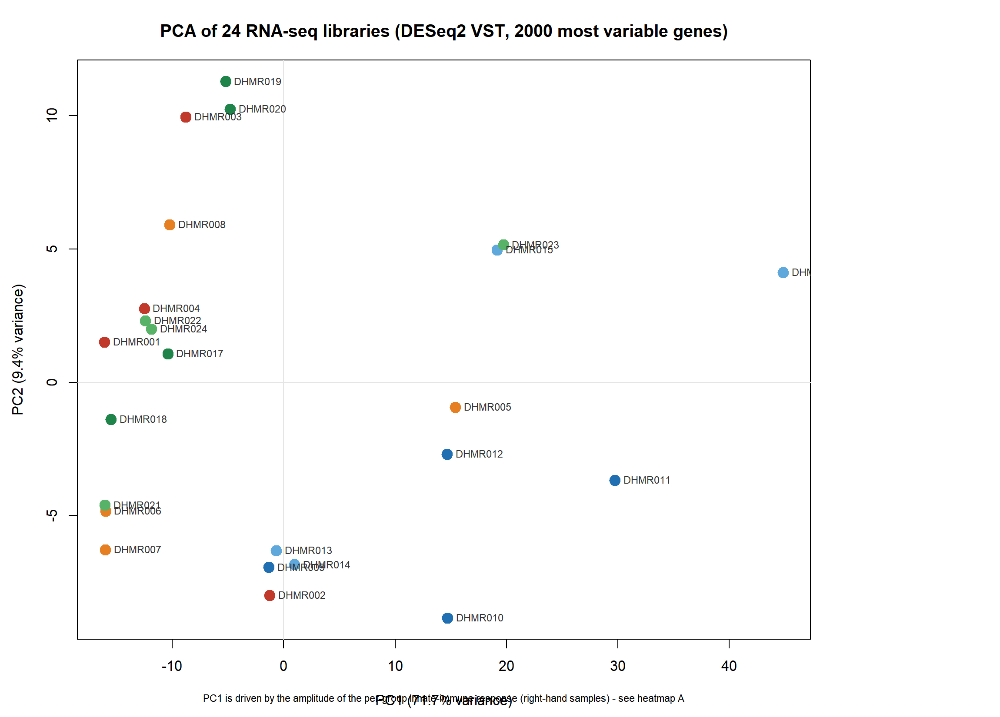
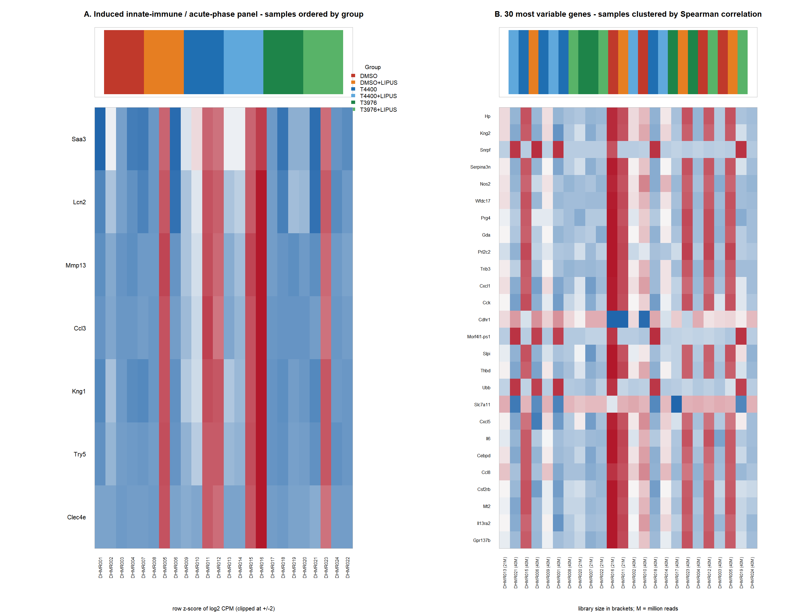
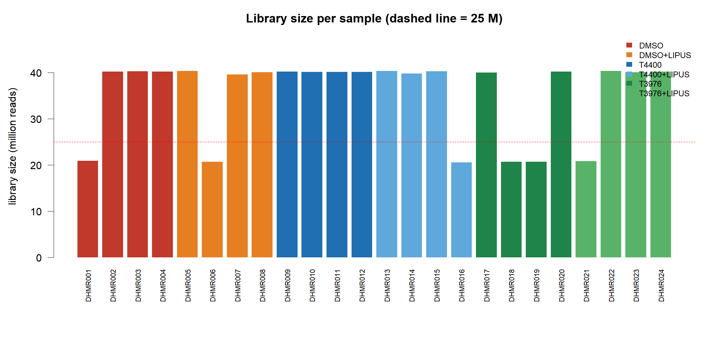
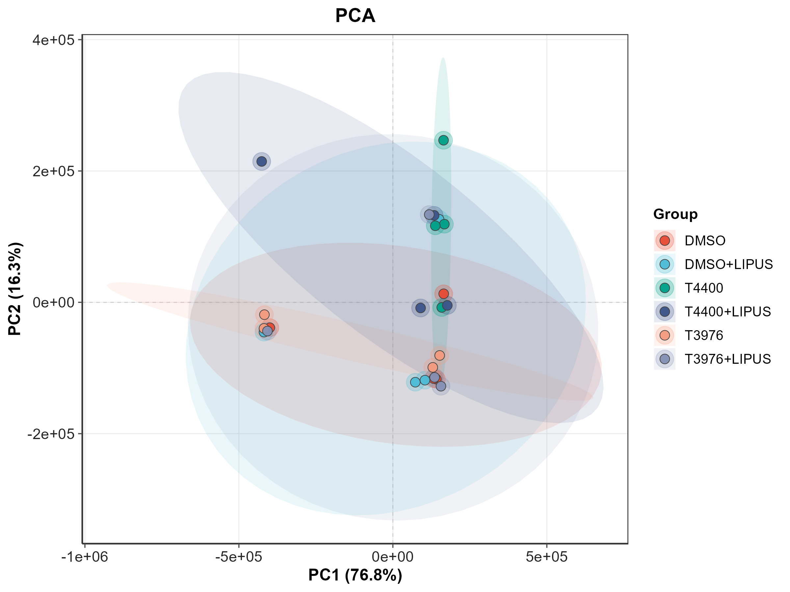
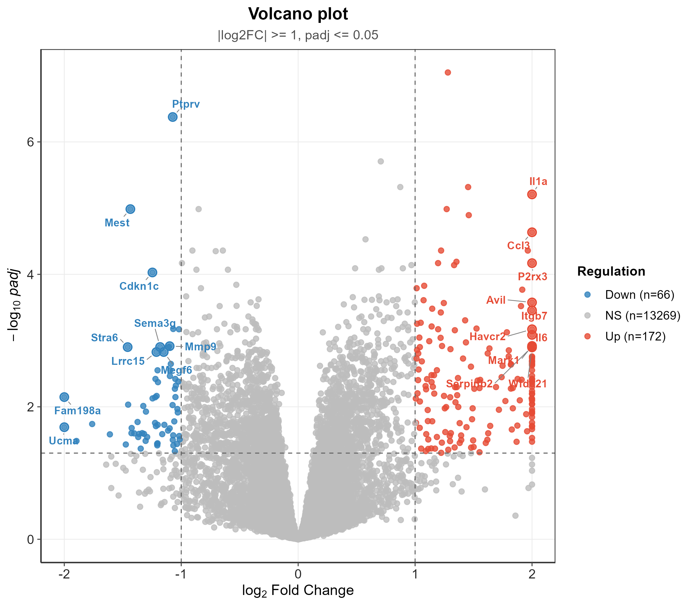
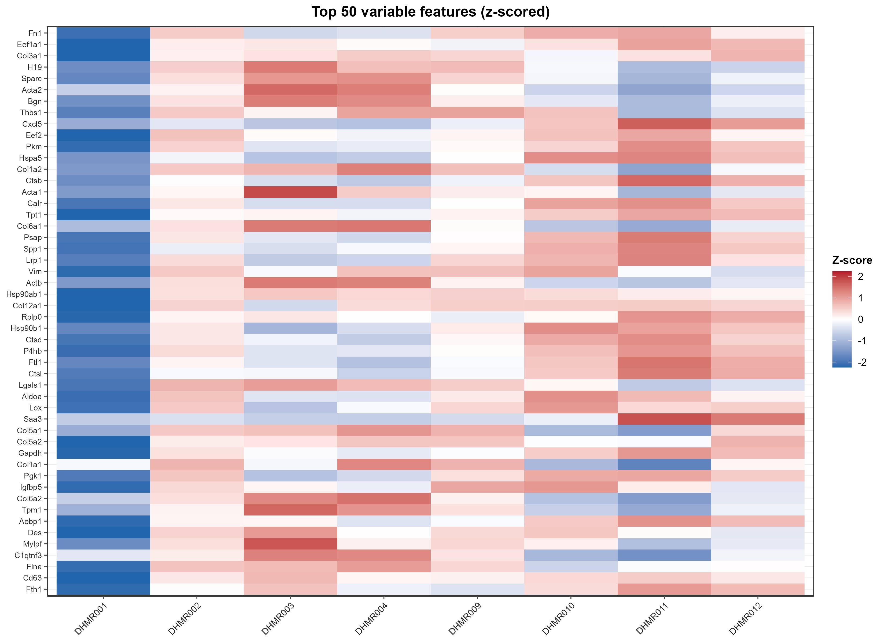
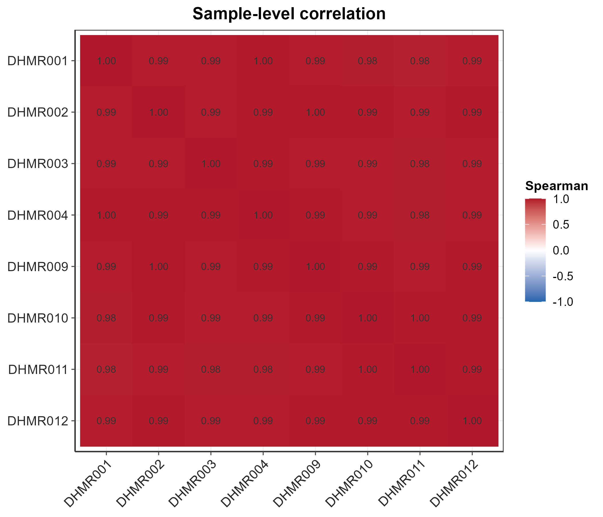

# Week 5 Homework 2 - RNA-seq analysis with EasyMultiProfiler-Web

Student: 郑烁曈 (SUAT24000155) | Date: 2026-09-22 | App: EasyMultiProfiler-Web v9.0.4
Session: `1wtLICpulEfL2UusJulisZ9V`, experiment `rnaseq_week5`, run bundle `20260922-185729.zip`

## 1. Dataset identified in `EasyMultiProfiler-Web/tests`

| File | Content |
|---|---|
| `RNAseq_output.csv` | raw integer count matrix, 24,394 genes (mouse symbols) x 24 libraries, first column `feature` |
| `RNAseq_mapping.csv` | sample metadata, 24 rows: `SampleID` (DHMR001-DHMR024) + `Group` |

These are the only RNA-seq CSV files in the `tests` folder (the others are 16S and clinical).
Design: 6 groups x 4 libraries - `DMSO`, `DMSO+LIPUS`, `T4400`, `T4400+LIPUS`, `T3976`,
`T3976+LIPUS` (three treatments: vehicle, compound T4400, compound T3976; each +/- LIPUS
ultrasound co-treatment).

## 2. How the analysis was run

The web UI's own HTTP API is the same code path the buttons call, so the analysis was driven
through it (the UI was not opened because another local program already occupied port 8000):

1. `POST /api/import/path` with the two CSV files -> session `1wtLICpulEfL2UusJulisZ9V`,
   experiment `rnaseq_week5`, 24 samples, 19,150 features retained after the app's import filter,
   sample overlap assay/metadata = 24/24, no warnings.
2. `POST /api/workflows/rnaseq/run_all` (one-click RNA-seq): PCA + scatter, DESeq2 differential
   (DMSO reference vs T4400), volcano, DEG/top-variance heatmaps, sample-correlation matrix,
   KEGG/GO enrichment. Results were packaged by the app into `20260922-185729.zip`.
3. Five further DESeq2 contrasts through `POST /api/analyze/differential`
   (`group_var = Group`, `subset_two_groups = true`, DESeq2) with the full tables pulled from
   `GET /api/analyze/diff_raw`.
4. `POST /api/github/sync` to publish the results to the homework repository (see §7).

Reproducible scripts: `run_contrasts.py` (contrasts), `verify_contrasts.py` (independent check),
`hw2_stats.py` (QC + panel statistics), `hw2_figures.R` (base-R figures).

## 3. Quality control (what the data actually looks like)

| Observation | Number |
|---|---|
| Library size | 20.5 - 40.4 million reads; 6 of 24 libraries at about half depth (DHMR001, 006, 016, 018, 019, 021) |
| Zero fraction per library | 32.6 - 36.3 % of genes have zero counts (higher in the 6 shallow libraries) |
| Sample-sample Spearman correlation (log1p) | 0.97 - 0.99 for all 552 pairs - no sample is globally broken |
| PCA (DESeq2 VST, 2,000 most variable genes) | PC1 = 71.7 %, PC2 = 9.4 % (figures/hw2_pca.png) |
| PC1 by group (mean) | DMSO -9.7, DMSO+LIPUS -6.7, T4400 +14.4, T4400+LIPUS +16.1, T3976 -9.0, T3976+LIPUS -5.2 |
| Single-sample immune responders (panel score > 1) | DHMR002 (DMSO), DHMR005 (DMSO+LIPUS), DHMR023 (T3976+LIPUS) |

The dominant axis of variation (PC1) separates the T4400 arms from everything else, and the two
strongest single-sample responders (DHMR005, DHMR023) also sit high on PC1. It is *not* a clean
group separation: within each group one library - and in T4400 two libraries - carries a much
stronger version of the same program (figure A of `figures/hw2_panel_heatmap.png`). This
single-library structure is the most important QC finding, because it inflates the within-group
variance and therefore decides which contrasts reach significance.

## 4. Differential expression results (DESeq2, padj < 0.05 and |log2FC| >= 1)

| Contrast | Genes tested | Significant | Up | Down |
|---|---|---|---|---|
| DMSO vs T4400 | 16,757 | **238** | 172 | 66 |
| DMSO vs T3976 | 16,606 | 1 | 0 | 1 (`Krt19`) |
| DMSO vs DMSO+LIPUS | 16,630 | 0 | 0 | 0 |
| T4400 vs T4400+LIPUS | 16,730 | 0 | 0 | 0 |
| T3976 vs T3976+LIPUS | 16,584 | 4 | 4 | 0 (`Kif26a`, `3632451O06Rik`, `Fxyd6`, `Tcap`) |
| DMSO+LIPUS vs T4400+LIPUS | 16,730 | 0 | 0 | 0 |

Only the T4400 arm (against vehicle) produces a substantial, threshold-passing response. Full
tables: `tables/contrast_*.csv`, `emp_run_bundle/tables/02_deseq2_raw.csv`.

Top genes for DMSO vs T4400 (padj order): `Cep290` +1.28 (padj 8.9e-08), `Ptprv` -1.07 (4.2e-07),
`Dcn` +1.45 (4.8e-06), `Il1a` +2.34 (6.2e-06), `Mest` -1.43, `Prdm1` +1.27, `Aldh1l2` +1.46,
`Ccl3` +5.12 (2.3e-05), `Erv3` +1.96, `Nrn1` +1.22, `Ero1l` +1.35, `Map3k8` +1.20, `P2rx3` +2.50,
`Cxcl10` +1.33, `Cdkn1c` -1.25. Family content of the 238 genes: 7 `Serpin*`, 6 `Ccl*`, 5 `Mmp*`,
4 `Il*`, 3 `Cxcl*`, 2 `Saa*`, 2 `Kng*`, 2 `Mx*`, 2 `Ifit*`, 1 `Oas*`, 1 `Lcn*`, 1 `Try*`.

### The induced program, and how consistent it really is

Mean counts per group for the program that dominates the result (`tables/panel_cpm.csv`):

| Gene | DMSO | DMSO+LIPUS | T4400 | T4400+LIPUS | T3976 | T3976+LIPUS |
|---|---|---|---|---|---|---|
| `Saa3` | 1,275 | 8,998 | 18,969 | 18,206 | 552 | 7,877 |
| `Lcn2` | 88 | 511 | 1,083 | 1,032 | 82 | 498 |
| `Mmp13` | 3.2 | 65.8 | 126.5 | 121.0 | 2.8 | 52.8 |
| `Ccl3` | 1.8 | 31.5 | 66.5 | 63.0 | 0.2 | 26.0 |
| `Kng1` | 21.5 | 229 | 472 | 454 | 10.5 | 219 |
| `Try5` | 9.0 | 164 | 304 | 348 | 3.8 | 148 |
| `Clec4e` | 1.0 | 18.5 | 34.5 | 36.8 | 1.0 | 16.0 |

Per-library counts show whether the shift is carried by all four replicates or by one library
(examples, DMSO vs T4400): `Ccl3` 0/5/1/1 vs 12/23/134/97, `Mmp13` 0/11/2/0 vs 25/42/240/199,
`Lcn2` 25/173/90/66 vs 178/316/2,044/1,792, `Saa3` 87/3,987/706/321 vs 3,134/7,097/35,870/29,773.
For these genes every T4400 library is at or above the highest DMSO library, so the T4400 shift is
a real group-level difference - but it is amplified two- to twenty-fold in one or two "responder"
libraries, and the same panel flares up in single libraries of the other groups (DHMR005 in
DMSO+LIPUS, DHMR023 in T3976+LIPUS), which is why the LIPUS-only and T3976 contrasts are empty.

## 4b. Figures

**Figure 1** - PCA of the 24 libraries (DESeq2 VST, 2,000 most variable genes). PC1 (71.7 %)
separates the T4400 arms from vehicle and T3976; the two single-sample responders (DHMR005,
DHMR023) also sit high on PC1.

**Figure 2** - A: the seven-gene induced panel (samples ordered by group, colour strip = group);
one library per group - two in T4400 - carries an amplified version of the program. B: the 30 most
variable genes with samples clustered by Spearman correlation; library size in brackets.

**Figure 3** - Library size per sample; six libraries are at about half depth (dashed line 25 M).

**Figure 4** - The app's own figures from the one-click RNA-seq run (DMSO vs T4400): PCA scatter,
volcano plot, top-variance heatmap and sample-correlation matrix.

## 5. Verification of the app's output (independent checks)

| Check | Result |
|---|---|
| Contrast assignment (app log2FC vs my pseudo-bulk log2FC computed straight from the CSV) | Pearson r = 0.944 (DMSO vs T4400) and 0.951 (DMSO+LIPUS vs T4400+LIPUS) - the right samples were compared |
| Stored DESeq2 table internally consistent (`pvalue` == 2*pnorm(-abs(stat)), BH monotone) | r = 1.000, zero BH violations |
| App DEG list `tables/04_deg_list.csv` | 1,395 rows, but 1,157 of them are all-`NA` placeholder rows; only 238 pass padj < 0.05 and \|log2FC\| >= 1. The headline "1,395 DEGs" from the bundle is an over-count; 238 is correct |
| p-values in the JSON export | rounded to 4 decimals, so p < 1e-4 is exported as 0; `padj` (used for every threshold here) is unaffected at padj < 0.05 |
| Enrichment | KEGG and GO both failed with "OrgDb package `org.Mm.eg.db` for organism `mmu` is not installed", so pathway enrichment is not available in this run (logged in `emp_run_bundle/summary.txt`) |
| Library depth vs result | the two most extreme PC1 libraries include both a half-depth library (DHMR016) and a full-depth one (DHMR011), so depth alone does not explain the pattern |

## 6. Biological interpretation

The T4400 arm shows a coordinated **innate-immune / acute-phase plus extracellular-matrix
remodelling** response. Acute-phase and iron-sequestration genes (`Saa3` ~15x, `Lcn2` ~12x),
chemokines and their receptors (`Ccl3` ~37x, `Ccl8`, `Cxcl1`, `Cxcl10`), interferon-stimulated
genes (`Mx2`, `Oas*`, `Ifit2`), matrix metalloproteinases and proteases with their inhibitors
(`Mmp13` ~40x, `Try5` ~34x, `Serpinb2`, `Serpina3n`), the innate sensing lectin `Clec4e`
(Mincle), `Il1a`/`Il6`, and the ECM protein `Dcn` all move in the same direction, together with
cell-cycle arrest markers (`Cdkn1c`) and `Prdm1`. In functional terms this is a wound/inflammation-like
transcriptional state: leukocyte chemoattraction, acute-phase protein secretion and matrix
degradation, which is the response expected when cells are exposed to a pro-inflammatory or
stress-inducing insult rather than a clean differentiation stimulus.

Whether that state is caused by the compound itself cannot be settled here. The same program
appears, at lower amplitude, in one library of the vehicle + LIPUS group and one of the
T3976 + LIPUS group, so the response looks like a cell-state switch that occurs in a subset of
libraries in every arm, with T4400 pushing more libraries across the threshold. LIPUS alone
(0 genes) and T3976 alone (1 gene) do not reproduce it, and adding LIPUS to either compound adds
nothing detectable (4 genes for T3976+LIPUS vs T3976, 0 for T4400+LIPUS vs T4400), i.e. there is
no add-on effect of ultrasound at this sample size.

## 7. Submission

- Results, figures, tables and scripts of this week are in this folder and were pushed to
  `zhashutiaoye-sketch/Bioinformatics_homework_Zheng-Shuotong` under `week5/`.
- `POST /api/github/sync` was used to publish the app's own run bundle for this session (the
  student account is bound to the repository above); the local sync history is returned by
  `GET /api/github/syncs`.

## 8. Limitations

1. n = 4 per group, and one library per group carries an amplified version of the induced
   program, so within-group variance is dominated by single libraries; the T4400 result is
   therefore hypothesis-generating, not confirmed.
2. The identities of T4400 / T3976 and the origin of the DHMR dataset are not documented in the
   `tests` folder, so the interpretation stays descriptive (no named pathway or target).
3. No pathway enrichment was possible (`org.Mm.eg.db` missing), so the functional reading relies
   on gene-symbol families, not on a statistical over-representation test.
4. 6 of 24 libraries are at half sequencing depth; DESeq2 size factors correct the overall level
   but power in those groups is lower.
5. The DE call uses the app's raw `pvalue`/`padj` from the stored DESeq2 table; the app's exported
   CSV rounds p-values, which is why the counts in §4 were recomputed from the full-precision
   `padj` column.

## 9. AI use and verification (documented)

The analysis was executed by an AI assistant working on this machine; every number above comes
from the app's own run or from the verification scripts in this folder, and both were re-run and
inspected. Two AI-relevant corrections are recorded in §5: the app's DEG list over-count
(1,395 -> 238) and the exported p-value rounding. The interpretation was written by the assistant
and checked against the per-library counts reproduced in §4.
